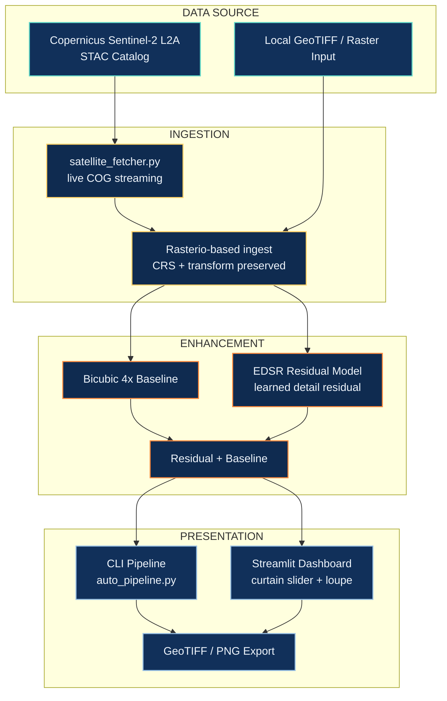

<div align="center">

# GeoSR

**Satellite Imagery Super-Resolution Platform**

[](https://python.org)
[](https://pytorch.org)
[](https://streamlit.io)
[](https://sentinel.esa.int/web/sentinel/missions/sentinel-2)
[](https://dataspace.copernicus.eu/)
[](https://rasterio.readthedocs.io)
[](LICENSE)

</div>

---

## Overview

GeoSR is an end-to-end visual-enhancement platform for Sentinel-2 satellite imagery. It streams live imagery directly from the Copernicus data catalog, reconstructs a 4x enlarged pixel grid using a residual EDSR model, and presents the result alongside a bicubic baseline through an interactive comparison interface.

The model produces AI-enhanced imagery — a learned detail residual added to a bicubic upscale — not verified recovery of true sub-pixel ground detail.

---

## Table of Contents

- [Architecture](#architecture)
- [Capabilities](#capabilities)
- [Tech Stack](#tech-stack)
- [Project Structure](#project-structure)
- [Getting Started](#getting-started)
- [Evaluation Note](#evaluation-note)
- [Team](#team)

---

## Architecture



**Core design decision:** the model learns a detail *residual*, added once to a bicubic 4x base, with forced sharpening disabled. This keeps enhancement conservative and reversible to baseline, rather than producing artifacts that look sharp but are unmoored from the source signal.

---

## Capabilities

| Capability | Detail |
|---|---|
| Residual reconstruction | Deployed EDSR checkpoint learns a detail residual over a bicubic 4x base — not an unconstrained generative upscale |
| Live Copernicus STAC streaming | Queries open Sentinel-2 L2A catalogs directly and streams Cloud-Optimized GeoTIFFs for any target city or bounding box, in real time — no pre-downloaded dataset required |
| Raster-aware ingest | Reads geospatial rasters via Rasterio where available, preserving CRS and output transform rather than treating imagery as generic RGB |
| Enterprise web interface | Streamlit dashboard with an interactive split-screen curtain slider, digital loupe magnification (2x–8x), synchronized dual views, and direct GeoTIFF/PNG export |
| CLI pipeline | Batch or single-scene processing via `auto_pipeline.py`, for preset landmark scenes or arbitrary local imagery |

---

## Tech Stack

| Layer | Technology |
|---|---|
| Modeling | PyTorch, EDSR |
| Data Source | Copernicus Sentinel-2 L2A (live STAC catalog) |
| Geospatial Handling | Rasterio (CRS-aware raster I/O) |
| Interface | Streamlit (web), Python CLI |
| Imagery Format | Cloud-Optimized GeoTIFF (COG), PNG export |

---

## Project Structure

```
GeoSR/
├── api/
│   ├── copernicus.py            Copernicus CDSE token and catalog query client
│   └── satellite_fetcher.py     Live Sentinel-2 L2A STAC streaming engine
├── app/
│   └── app.py                   Enterprise Streamlit web application
├── data/
│   ├── presets/                 Verified landmark scenes (400x400 crops)
│   └── B02_10m.jp2 ...          Native Sentinel-2 L2A bands (10m)
├── models/
│   └── edsr_visual_best.pth     Satellite-tuned EDSR weights
├── outputs/
│   └── enhanced/                Super-resolved 4x PNGs and comparisons
└── src/
    ├── auto_pipeline.py         Automated CLI super-resolution runner
    ├── processor.py             Photometric enhancement and inference engine
    └── extract_hero_presets.py  Extraction utility for landmark scenes
```

---

## Getting Started

**1 — Launch the web interface**
```powershell
.\.venv\Scripts\streamlit run app/app.py
```
Open `http://localhost:8501` to query live Sentinel-2 scenes, explore pre-cached landmark presets, or ingest local GeoTIFFs.

**2 — Run the CLI pipeline**

Super-resolve a single landmark scene:
```powershell
.\.venv\Scripts\python.exe src/auto_pipeline.py --preset stadium_airport
```

Batch process all verified landmark scenes:
```powershell
.\.venv\Scripts\python.exe src/auto_pipeline.py --all-presets
```

Enhance any local imagery file:
```powershell
.\.venv\Scripts\python.exe src/auto_pipeline.py --input path/to/image.tif --output outputs/enhanced/
```

---

## Evaluation Note

The current interface displays Laplacian variance and gradient energy as on-screen statistics. These are not accuracy metrics — sharpening can increase both without recovering correct geographic detail, and they should be read as display diagnostics only, not evidence of reconstruction quality. A benchmark comparing outputs against registered higher-resolution reference imagery using PSNR/SSIM has not been run.

---

## Team

Built by **Rizz Coders** for Smart India Hackathon 2026 — problem statement SIH26142.

| Name | 
|---|
| Rudransh Chauhan |
| Bhavya Kodnani   | 
| Tarun Upadhyay   |
| Raghuvansh Tiwari|
